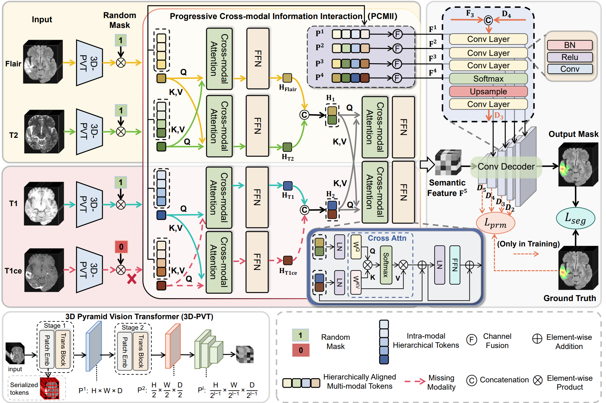

## HPCMII
Code for this paper: Hierarchical Progressive Cross-modal Information Interaction for Incomplete Multimodal Brain Tumor Segmentation


## Requirements
1. Create conda environment:
   ```bash
   conda create -n HPCMII python=3.11
   ```
2. Clone the repo
3. Activate the environment:
   ```bash
   conda activate HPCMII
   ```
4. Install the requirements


## Usage
Before running the training script, please make sure to set the dataset path in `config.yml`. Then, you can start training and testing by executing:
```bash
python train.py
python eval_DICE.py
```
